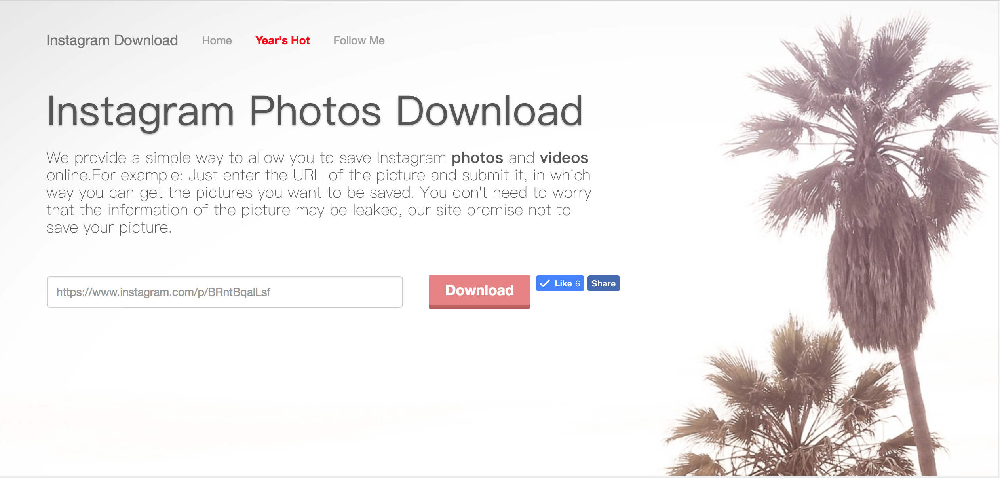
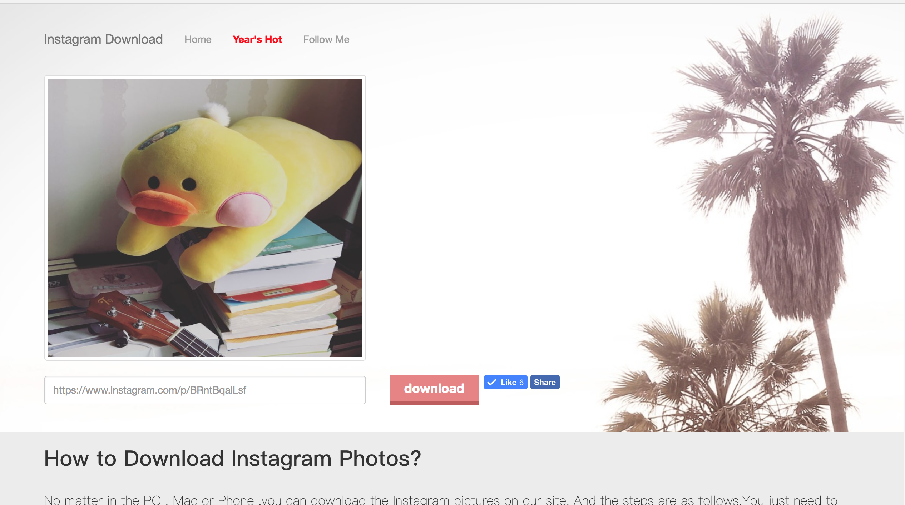
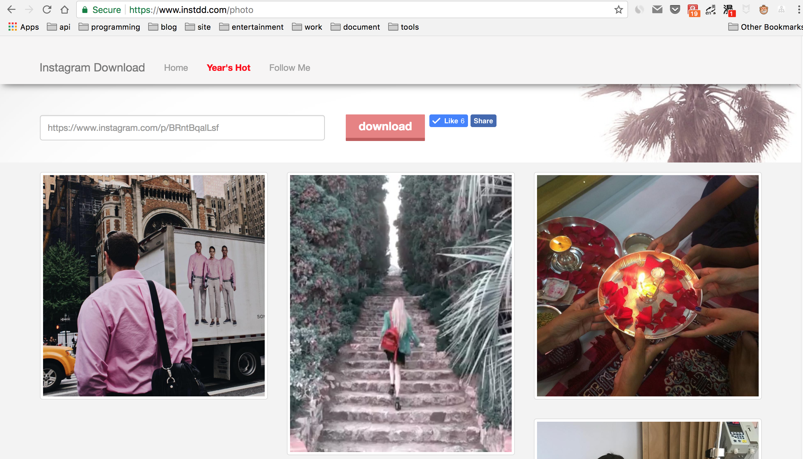

## instdd - Instagram **photos** and **videos** online



---

### How to Use?

This project provide a simple way to allow you to save Instagram **photos** and **videos** online.

Just enter the URL of the picture and submit it, in which way you can get the pictures you want to be saved. 

instead build with sanic.

Click here: [https://www.instdd.com/](https://www.instdd.com/)

**Feature**:

- save Instagram **photos**  online
- save Instagram  **videos** online
- year's hot

### Install

- linux
- python3

``` shell
git clone https://github.com/howie6879/instdd.git
cd instdd
pip install -r requirements.txt
cd instdd
python server.py
```

### Site screenshots





### Wechat

请关注 **图图推**


### License

License

